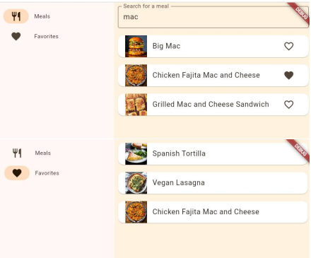

# Flutter-welcoming

This is a simple project to get started with Flutter. The web allows to search for meals and add them to a list of favorites.

Here's the result of the web page:



## Getting Started 
To get started, you need to have Flutter and VsCode installed on your machine. If you don't have it, you can follow the instructions on the [official website](https://flutter.dev/docs/get-started/install).


## Running the project 

To run the project, you can use the 'run' button on VsCode or open the terminal and run the following command:

```bash
flutter run -d chrome
```

This command will run the project on the web browser on debug mode.

## Deployment 

To deploy the project, you need to run the following command:

```bash
flutter build web
```

This command will generate a folder called `build/web` with the files needed to deploy the project. You can use this folder to deploy the project on a web server.

## Main file

The main file is located at `lib/main.dart`. This file contains the main structure of the project and the routes used to navigate between pages. 

## Tutorial

Full tutorial with explanations available on `docs` folder.

## Authors

| Full name                          | Github user                                              |
|------------------------------------|----------------------------------------------------------|
| Elena Ballesteros Morallón         | [@elena-17](https://github.com/elena-17)                 |
| Antonio Campallo Gómez             | [@antoniocg73](https://github.com/antoniocg73)           |

Course: Web Systems Development, University of Castilla-La Mancha

